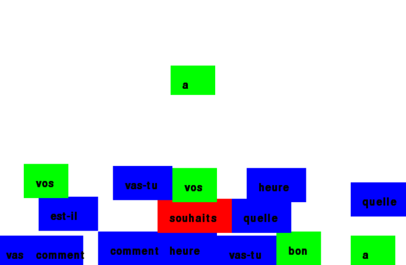
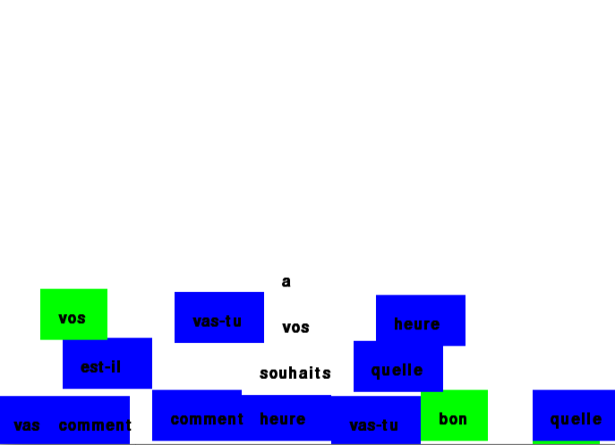

# Phrasis

Phrasis is a tetris game for learning phrases.  Each block has a word, and adjacent blocks that form phrases in the correct order disappear.

The game uses the pygame library for the interface, and uses [a graph to store data](https://github.com/Nasreen123/language_tetris/blob/master/Exploring%20graph%20algorithms%20for%20storing%20game%20data.ipynb).







## Usage

### Running the game

Save a copy of this code to your computer.  (Type ```git clone https://github.com/Nasreen123/language_tetris.git``` into your terminal).

You must have pygame installed to play this game.  (Type ```pip install pygame``` or ```pip install -r requirements.txt``` into your terminal).  

Run language\_tetris.py to play.  (Type ```python language_tetris.py``` into your terminal)

### Using your own phrases

To use your own set of phrases, save them in a text file in the same directory as the game.  Each phrase should be on it's own line, and each word should be separated by a space.

Include the name of the file as an argument when you run the game.  If you named the file 'myphrases.txt', you would type:
```python language_tetris.py myphrases.txt```
